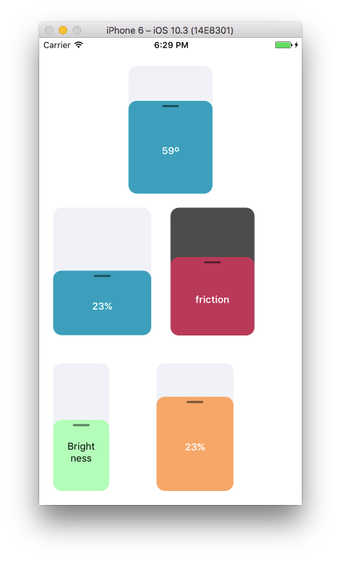

# react-native-big-slider


<a href="https://getyeti.co" target="_blank">
   
</a>

> This package powers [Yeti Smart Home](https://getyeti.co) and is used in production.

A react native reusable and efficient dial knob element.

## Usage



To achieve the previously shown elements, you can take a look at the example
or use the following snippets:

```javascript
import BigSlider from 'react-native-big-slider'

// ...

<BigSlider minimumValue={-50}
  label={`${this.state.valA | 0}º`}
  value={this.state.valA} onValueChange={valA => {
    this.setState({ valA })
  }} />

// ...

<BigSlider
  horizontal
  maximumValue={120}
  style={{ width: 140 }}
  value={this.state.valB}
  minimumValue={-120} />

// ...

<BigSlider
  horizontal
  maximumValue={120}
  style={{ backgroundColor: 'rgba(0,0,0,.7)' }}
  trackStyle={{ backgroundColor: 'rgba(194, 61, 85, 1)' }}
  label="friction"
  minimumValue={-120} />

// ...

<BigSlider
  style={{ width: 80 }}
  renderLabel={() => <Text style={{textAlign:'center', padding: 20}}>
    Brightness
  </Text>}
  trackStyle={{ backgroundColor: 'rgba(143, 255, 160, .7)' }}
  maximumValue={30}
  minimumValue={-120}
  value={this.state.valB} />

// ...

<BigSlider
  style={{ width: 110 }}
  trackStyle={{ backgroundColor: 'rgb(255, 166, 102)' }}
  maximumValue={30}
  minimumValue={-120}
  value={this.state.valB} />
```

More documentation is incoming, in the meanwhile please read the source code. It is a single file!
PRs and issues are more than welcome.

Follow us in Github or https://twitter.com/netbeast_co.
